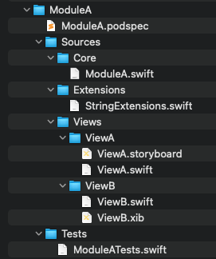
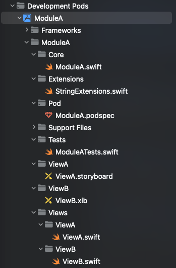

### CocoaPods issue - Generated development pod project structure is incorrect

Having resources produce a wrong generated project structure for a development pod:

The resources - `ViewA.storyboard`, `ViewB.xib` have wrong paths.

### Set up

Run `bundle install && bundle exec pod install && xed .`

### Workaround

Creating an empty file `workaround_project_stucture` (the naming does not matter) and adding it into the source files list of the podspec and into the resources list fixes the issue and displays the correct project structure which would be identical to the physical structure.
The workaround is available in the [workaround-project-structure branch](https://github.com/cristi-lupu/cocoapods-issue/tree/workaround-project-structure).

### Note

This issue (and the workaround) is also described on [stackoverflow](https://stackoverflow.com/a/65511402)
